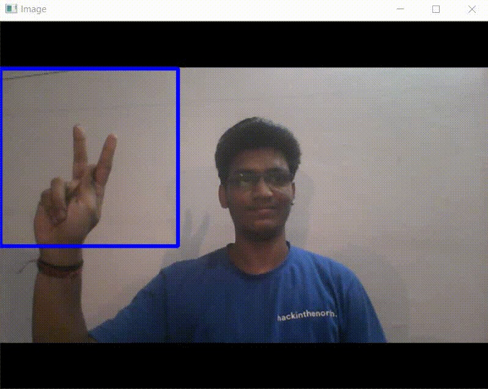
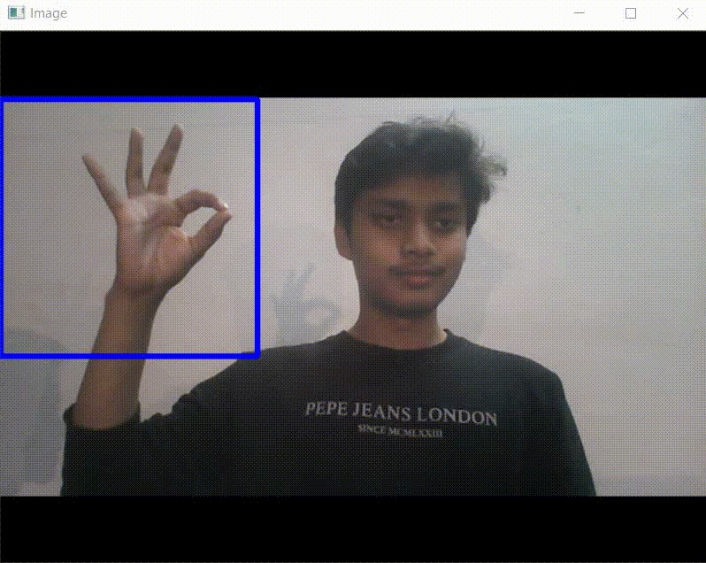
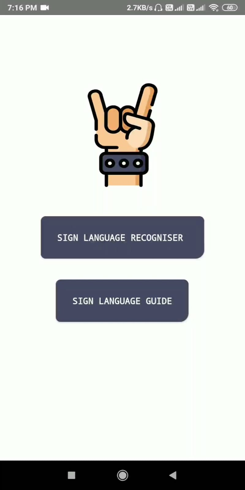
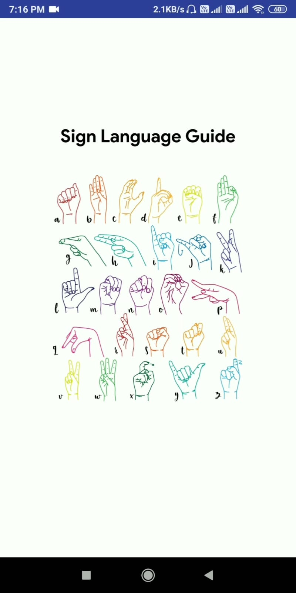
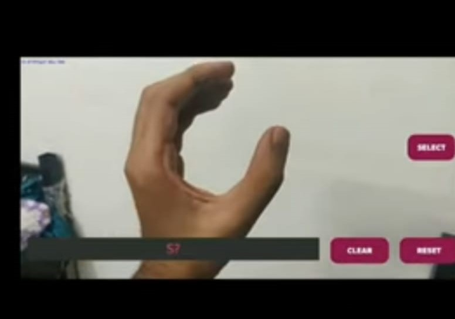
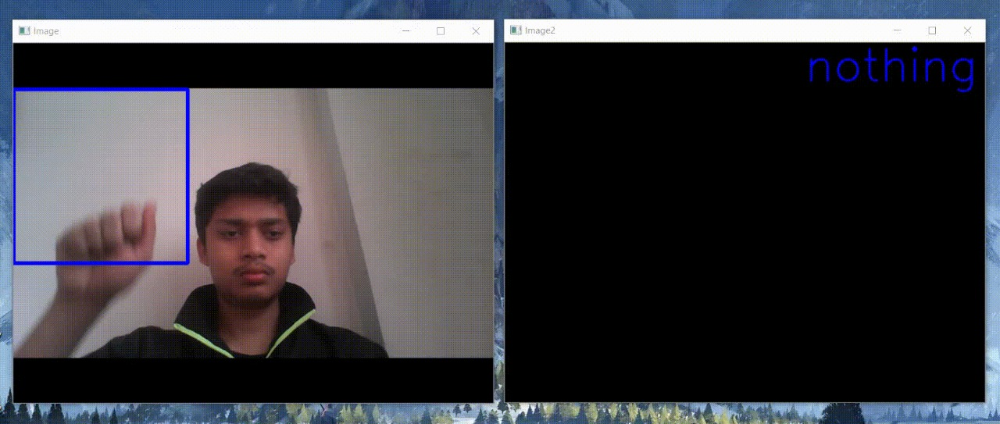
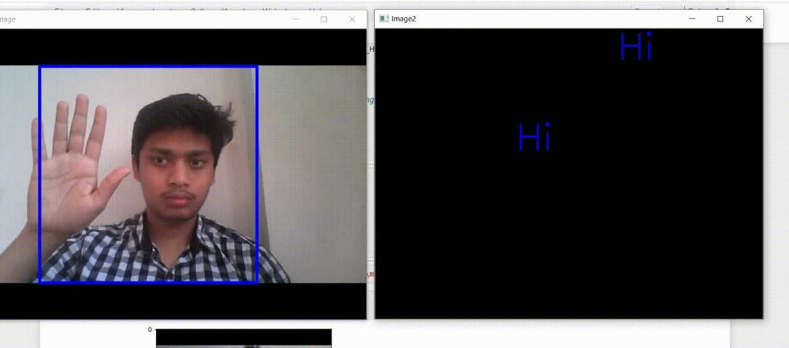

# Speaking Silence: A Sign Language Recogniser
## *Solution for Build for Digital India*

**Android App:** http://bit.ly/speakingsilenceapp 

**Video link:** https://www.youtube.com/watch?v=ORafm9Y7EtU

**Team Members**
- Govind Dixit (Team Leader)
- Swastik Singh
- Dushyant Singh
- Rohit Verma

**Database Creation**

We have modified and updates the database for better prediction with Indian conditions.

<table>
   <tr>
      <td></td>
      <td></td>
  </tr>
</table>

**Screenshots of the Android App**

<table>
   <tr>
      <td></td>
      <td></td>
      <td></td>
  </tr>
</table>

**Screenshots of the Desktop App**

<table>
   <tr>
      <td></td>
  </tr>
  <tr>
      <td></td>
  </tr>
</table>

